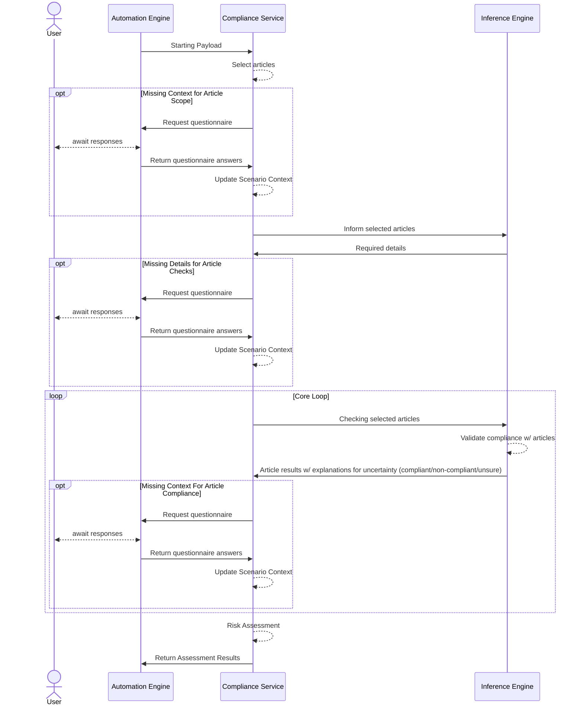

```mermaid
sequenceDiagram
	actor User
	participant Automation Engine
	participant Compliance Service
	participant Inference Engine
	
	Automation Engine->>Compliance Service: Starting Payload
	Compliance Service-->>Compliance Service: Select articles
	opt Missing Context for Article Scope
		Compliance Service->>Automation Engine: Request questionnaire
		Automation Engine<<-->>User: await responses
		Automation Engine->>Compliance Service: Return questionnaire answers
		Compliance Service-->>Compliance Service: Update Scenario Context
	end
	Compliance Service->>Inference Engine: Inform selected articles
	Inference Engine->>Compliance Service: Required details
	opt Missing Details for Article Checks
		Compliance Service->>Automation Engine: Request questionnaire
		Automation Engine<<-->>User: await responses
		Automation Engine->>Compliance Service: Return questionnaire answers
		Compliance Service-->>Compliance Service: Update Scenario Context
	end
	loop Core Loop 
		Compliance Service->>Inference Engine: Checking selected articles
		Inference Engine-->>Inference Engine: Validate compliance w/ articles
		Inference Engine->>Compliance Service: Article results w/ explanations for uncertainty (compliant/non-compliant/unsure)
	
		opt Missing Context For Article Compliance
			Compliance Service->>Automation Engine: Request questionnaire
			Automation Engine<<-->>User: await responses
			Automation Engine->>Compliance Service: Return questionnaire answers
			Compliance Service-->>Compliance Service: Update Scenario Context
		end
	end
	Compliance Service-->>Compliance Service: Risk Assessment
	Compliance Service->>Automation Engine: Return Assessment Results
```
